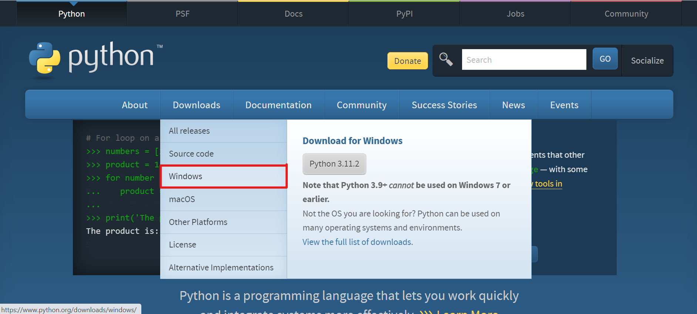
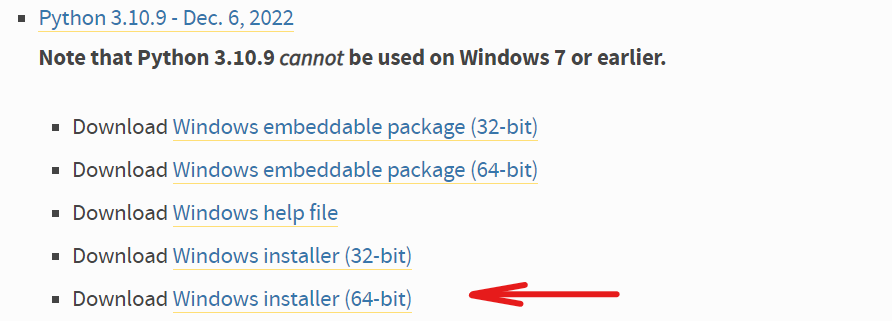
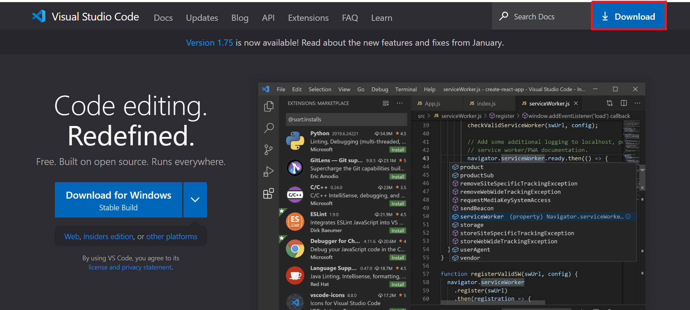
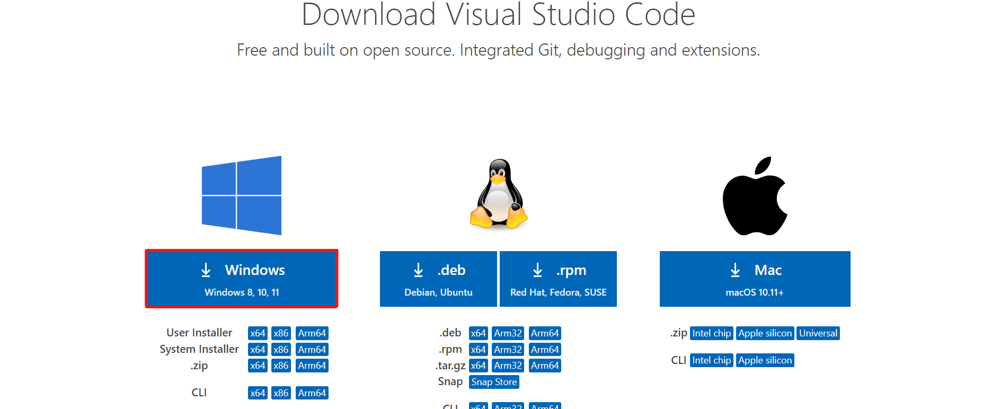
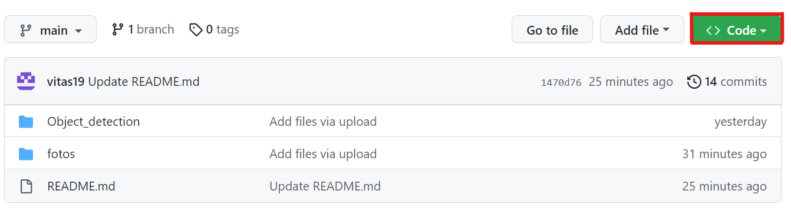
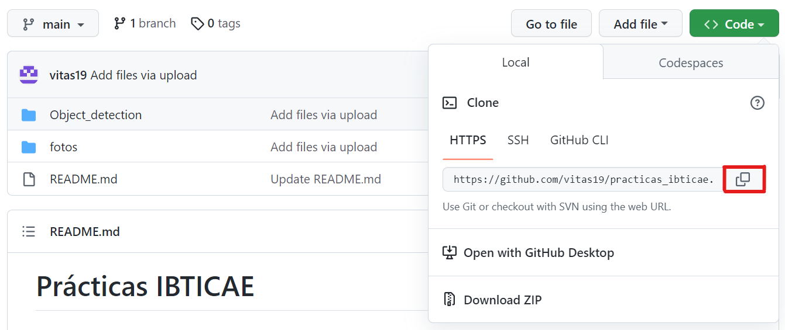

# Prácticas IBTICAE

## 0. Especificaciones técnicas
### 0.1. Sistema
- Windows 7 o superior (64 bits)

### 0.2. Software
La configuración que se presenta a continuación ha sido la usada para este proyecto, pero las versiones pueden variar para cada usuario:
- Python v. 3.10.9 (válido v. 3.7 - 3.10)
- Tensorflow v. 2.11.0 (válido v. 2.x)
- pip v. 22.3.1 (válido v. 20.3 y superiores)
- numpy v. 1.24.1
- scipy v. 1.10.0
- scikit-image v. 0.19.3
- matplotlib v. 3.6.3
- ipython v. 8.9.0
- opencv-python v. 4.7.0.68

## 1. Instalaciones previas
### 1.1. Descargar Python:
Se recomienda la descarga de Python desde su página oficial: https://www.python.org/ . Una vez se encuentre en esta página deberá acceder a Downloads y seleccionar el sistema operativo correspondiente (en este caso Windows):

Se debe de elegir una versión de Python que se encuentre entre 3.7 y 3.10 para que los paquetes que se vayan a instalar más adelante tengan soporte. Además, tiene que ser de 64-bits.

Una vez seleccionado, se empezará a descargar el archivo que una vez terminado tendremos que abrir. 

#### CONTINUAR CON EL OTRO ORDENADOR DELANTE

### 1.2. Descargar Visual Studio Code 
Para la descarga de Visual Studio Code, hay que dirigirse a su página oficial: https://code.visualstudio.com/ . Una vez ahí, aparecerá la siguiente pantalla en la cual nos dirigiremos a Download.

Nos tendremos que descargar el correspondiente a nuestro sistema operativo, que en este caso es Windows.

Con esto comenzará la descarga, una vez finalizado se deberá abrir para terminar con su instalación. 

#### CONTINUAR CON EL OTRO ORDENADOR DELANTE

## 2. Clonar repositorio

### 2.1. Descargar e incluir archivo de pesos
Se deberá descargar el siguiente archivo que debe de incluirse en la carpeta de mrcnn para el correcto funcionamiento:
[mask_rcnn_coco.h5](https://github.com/matterport/Mask_RCNN/releases/download/v2.0/mask_rcnn_coco.h5)

### 2.2. Instalar los paquetes en VSCode
Una vez se haya instalado lo anterior, podremos instalar los paquetes necesarios para este proyecto.\
pip install numpy tensorflow scipy scikit-image matplotlib ipython opencv-python

