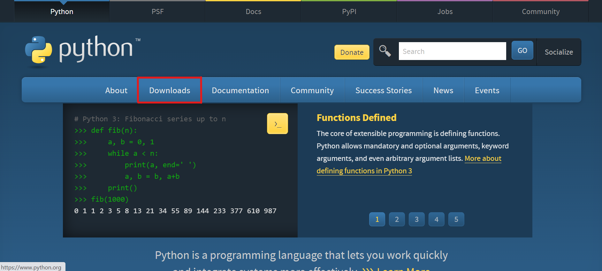

# Prácticas IBTICAE

## 1. Instalaciones previas
### 1. Descargar Python:
Se recomienda la descarga de Python desde su página oficial: https://www.python.org/ . Una vez se encuentre en esta página deberá acceder a Downloads y seleccionar el sistema operativo correspondiente (en este caso Windows):

